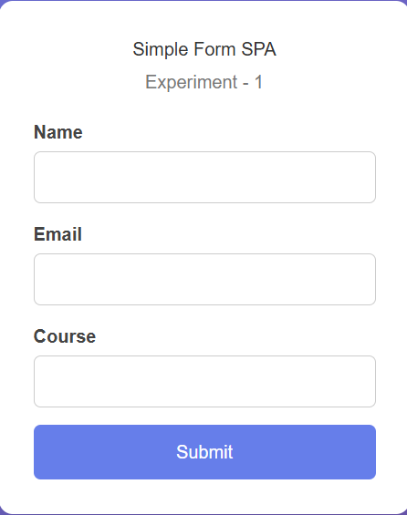

# Next.js Basic Form Application

# Output


## Overview
This repository contains a **Basic Form Application** developed using **Next.js (App Router)** and **React Hooks**.  
The project demonstrates how to build and manage controlled form inputs, handle user input events, and process form submissions in a modern Next.js environment.

This application is intended for academic labs, beginner learning, and foundational understanding of form handling in React and Next.js.

---

## Objectives
- Understand form handling in React and Next.js
- Learn the concept of **controlled components**
- Manage form data using React state
- Handle input and submit events
- Validate and process user input on the client side

---

## Technologies Used
- Next.js 13+ (App Router)
- React.js
- JavaScript / TypeScript
- JSX / TSX
- CSS (optional styling)

---

## Project Structure
```
next-basic-form-app/
│
├── app/
│   ├── page.tsx        # Form page (Client Component)
│   ├── layout.tsx      # Root layout
│
├── public/
│
├── package.json
├── next.config.js
└── README.md
```

---

## Application Explanation

### App Router Usage
The project uses the **Next.js App Router**, which provides file-based routing.  
The `app/page.tsx` file represents the root page of the application.

Since form input handling requires browser-side interactivity, the page is declared as a **Client Component**.

```ts
"use client";
```

---

### Controlled Form Components
All form inputs are implemented as **controlled components**, meaning their values are managed using React state.

Example state declaration:
```ts
const [name, setName] = useState("");
```

Each input field updates its corresponding state using the `onChange` event.

```tsx
<input
  type="text"
  value={name}
  onChange={(e) => setName(e.target.value)}
/>
```

This approach ensures that the UI and application state remain synchronized.

---

### Form Submission Handling
Form submission is handled using the `onSubmit` event.

```tsx
<form onSubmit={handleSubmit}>
```

The default browser behavior is prevented using `event.preventDefault()`, allowing custom processing of form data.

```ts
const handleSubmit = (e) => {
  e.preventDefault();
};
```

Upon submission, the entered data can be:
- Displayed on the screen
- Logged to the console
- Sent to an API endpoint
- Validated before further processing

---

### Input Validation (Basic)
Basic client-side validation can be applied to ensure required fields are filled before submission.

Example:
```ts
if (!name) {
  alert("Name is required");
}
```

This helps improve data integrity and user experience.

---

## Installation and Execution

### Step 1: Clone the Repository
```
git clone https://github.com/your-username/next-basic-form-app.git
```

### Step 2: Navigate to the Project Directory
```
cd next-basic-form-app
```

### Step 3: Install Dependencies
```
npm install
```

### Step 4: Run the Development Server
```
npm run dev
```

The application will be available at:
```
http://localhost:3000
```

---

## Use Cases
- Academic lab experiment on form handling
- Learning controlled components in React
- Understanding event handling and state updates
- Introductory Next.js App Router practice

---

## Future Enhancements
- Add multiple input fields (email, password, textarea)
- Implement advanced form validation
- Integrate backend API submission
- Add form reset functionality
- Convert to TypeScript with strict typing

---

## Learning Outcomes
After completing this project, a learner should be able to:
- Build controlled forms in React
- Manage and validate user input
- Handle form submission events
- Apply client-side logic in Next.js Client Components

---

## License
This project is licensed under the MIT License.

---

## Author
Chirag

