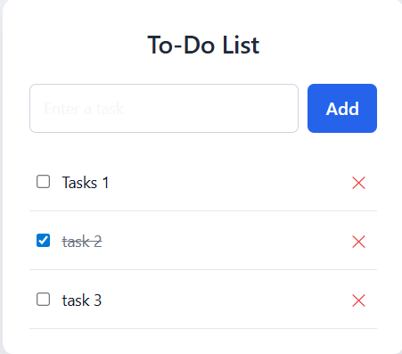

# Next.js To-Do List Application

# Output


## Overview
This repository contains a **To-Do List Application** developed using **Next.js (App Router)** and **React Hooks**.  
The project demonstrates how to manage dynamic lists, handle user input, and update the UI based on application state in a modern Next.js environment.

The application allows users to add tasks, mark them as completed, and manage a simple task list efficiently.  
It is suitable for academic labs, beginner practice, and foundational learning of state-driven UI design.

---

## Objectives
- Understand dynamic list rendering in React
- Learn state management using React Hooks
- Handle user input and events
- Implement add and update operations on a list
- Build an interactive client-side component in Next.js

---

## Technologies Used
- Next.js 13+ (App Router)
- React.js
- JavaScript / TypeScript
- JSX / TSX
- CSS (optional styling)

---

## Project Structure
```
next-todo-app/
│
├── app/
│   ├── page.tsx        # To-Do List page (Client Component)
│   ├── layout.tsx      # Root layout
│
├── public/
│
├── package.json
├── next.config.js
└── README.md
```

---

## Application Explanation

### App Router Usage
The application uses the **Next.js App Router**, which provides file-based routing.  
The `app/page.tsx` file represents the main page of the To-Do List application.

Since task management requires browser-side interactivity, the page is declared as a **Client Component**.

```ts
"use client";
```

---

### State Management
The application maintains two primary pieces of state:

```ts
const [tasks, setTasks] = useState<string[]>([]);
const [newTask, setNewTask] = useState("");
```

- `tasks` stores the list of to-do items
- `newTask` stores the current input value
- `setTasks` and `setNewTask` update their respective states

State updates automatically trigger UI re-rendering.

---

### Adding Tasks
Users can add new tasks through an input field and a button.

```ts
const addTask = () => {
  if (newTask.trim() !== "") {
    setTasks([...tasks, newTask]);
    setNewTask("");
  }
};
```

This logic:
- Prevents empty tasks from being added
- Updates the task list immutably
- Clears the input field after submission

---

### Rendering the Task List
The task list is rendered dynamically using the `map()` function.

```tsx
<ul>
  {tasks.map((task, index) => (
    <li key={index}>{task}</li>
  ))}
</ul>
```

Each task is displayed immediately after being added, demonstrating React’s declarative rendering model.

---

### Optional Task Completion
Task completion can be implemented using a checkbox or conditional styling to indicate completed tasks.  
This reinforces understanding of conditional rendering and state updates.

---

## Installation and Execution

### Step 1: Clone the Repository
```
git clone https://github.com/your-username/next-todo-app.git
```

### Step 2: Navigate to the Project Directory
```
cd next-todo-app
```

### Step 3: Install Dependencies
```
npm install
```

### Step 4: Run the Development Server
```
npm run dev
```

The application will be available at:
```
http://localhost:3000
```

---

## Use Cases
- Academic lab experiment on React state management
- Demonstration of dynamic list rendering
- Practice project for Next.js Client Components
- Interview or viva explanation of React fundamentals

---

## Future Enhancements
- Add task deletion functionality
- Implement task completion status
- Persist tasks using local storage
- Add drag-and-drop task ordering
- Integrate backend API for task storage

---

## Learning Outcomes
After completing this project, a learner should be able to:
- Manage arrays in React state
- Handle user-driven events
- Render dynamic lists efficiently
- Build interactive client-side features in Next.js

---

## License
This project is licensed under the MIT License.

---

## Author
Chirag
