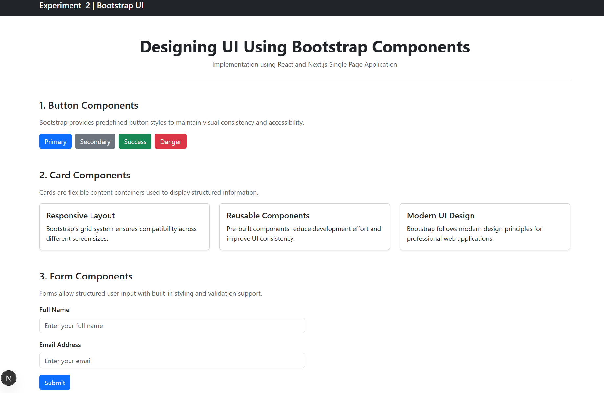

# Experiment–2: Designing UI Using Bootstrap Components

## Outputs

## Aim

To design a responsive user interface using a component library (**Bootstrap**) in a  using React.

---

## Objective

- To understand the concept of component libraries  
- To integrate Bootstrap with a React application  
- To design responsive UI elements using Bootstrap components  
- To observe responsive behavior across different screen sizes  

---

## Software Requirements

- **Operating System:** Windows / Linux / macOS  
- **Node.js:** v18 or later  
- **React:** Latest stable version  
- **Bootstrap:** v5.x  
- **Web Browser:** Google Chrome / Microsoft Edge / Mozilla Firefox  
- **Code Editor:** VS Code (recommended)

---

## Theory

Modern web applications require **consistent, responsive, and reusable user interfaces**. Component libraries help developers achieve this efficiently.

**Bootstrap** is a popular open-source CSS framework that provides:
- Predefined grid system
- Responsive utility classes
- Ready-to-use UI components

Common Bootstrap components include:
- Buttons
- Cards
- Forms
- Navigation bars
- Alerts and Modals

Using Bootstrap with React allows developers to rapidly build professional user interfaces without writing extensive custom CSS.

---

## Installation Steps

### Step 1: Create a React Application

```bash
npx create-react-app bootstrap-ui
cd bootstrap-ui
```

### Step 2: Install Bootstrap

```bash
npm install bootstrap
```

### Step 3: Import Bootstrap CSS

Open `src/index.js` or `src/main.jsx` and add:

```javascript
import 'bootstrap/dist/css/bootstrap.min.css';
```

---

## Procedure

1. Create a React application using Create React App.
2. Install Bootstrap using npm.
3. Import Bootstrap CSS into the project.
4. Create UI components using Bootstrap classes.
5. Use Bootstrap layout utilities to ensure responsiveness.
6. Run the application and observe the output.

---

## Sample Components Used

### Button
```html
<button className="btn btn-primary">Click Me</button>
```

### Card
```html
<div className="card" style={{ width: '18rem' }}>
  <div className="card-body">
    <h5 className="card-title">Bootstrap Card</h5>
    <p className="card-text">This is a sample card.</p>
  </div>
</div>
```

### Form
```html
<form>
  <input type="text" className="form-control" placeholder="Enter name" />
</form>
```

---

## Output

- A responsive UI is displayed in the browser.
- UI adapts to different screen sizes.
- Bootstrap components render correctly with React.

---

## Result

The responsive user interface was successfully designed using Bootstrap components in a React Single Page Application.

---

## Advantages of Bootstrap

- Faster development
- Responsive by default
- Cross-browser compatibility
- Consistent design system

---

## Conclusion

Bootstrap is an effective UI framework for building responsive and visually consistent web applications. When combined with React, it significantly improves development speed and maintainability.

---

## Learning outcomes


1. Apply Bootstrap components to design a responsive and structured user interface.

2. Integrate a CSS-based component library with a React and Next.js application.

3. Design reusable UI elements such as buttons, cards, forms, and navigation bars.

4. Demonstrate understanding of responsive web design using Bootstrap’s grid system.

5. Develop a professional Single Page Application using modern frontend technologies.
---


## Author

**Chirag**

---

## Experiment Number

**Experiment–2**
