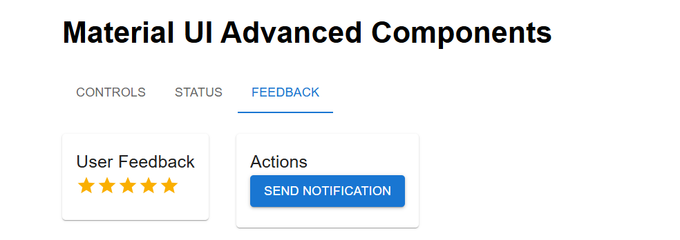
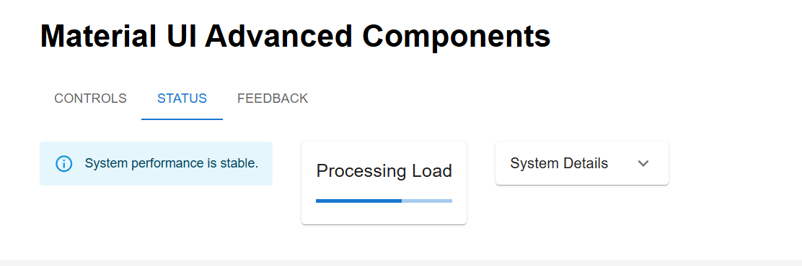
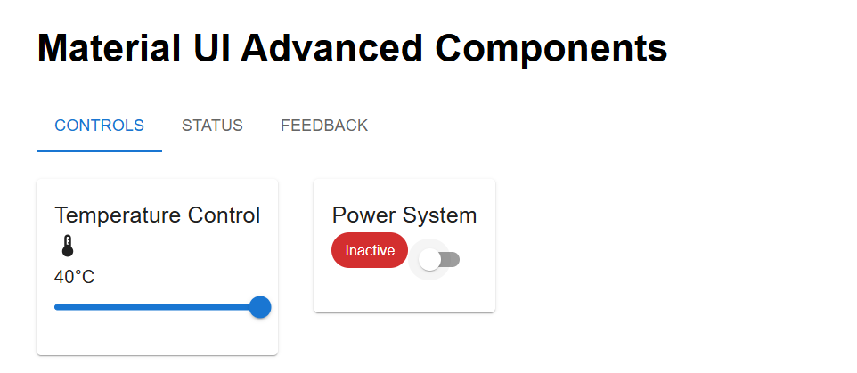
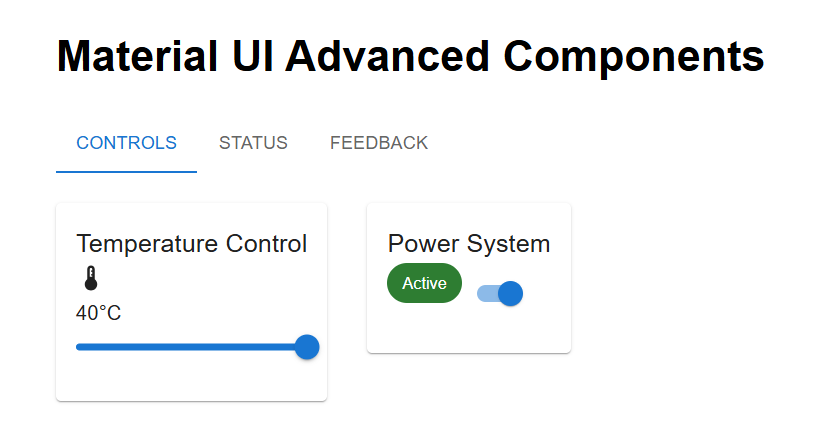

# Advanced Material UI Component Dashboard (Next.js)

## Outputs





## Aim

To design and implement an advanced user interface using **Material UI
components** integrated with a **Next.js App Router** application,
demonstrating component-based design and interactive UI elements.

------------------------------------------------------------------------

## Description

This project demonstrates the practical usage of multiple Material UI
components within a Next.js application. The dashboard simulates a smart
utility interface featuring controls, status indicators, notifications,
and user feedback mechanisms.

The application is not domain-specific (e-commerce or otherwise) and
focuses purely on **UI component exploration**, making it ideal for
academic labs and component framework experiments.

------------------------------------------------------------------------

## Technologies Used

-   Next.js (App Router)
-   React
-   Material UI (MUI)
-   TypeScript

------------------------------------------------------------------------

## Material UI Components Demonstrated

-   AppBar
-   Toolbar
-   Drawer
-   Tabs and Tab
-   Card
-   Accordion
-   Slider (Temperature Control)
-   Switch
-   Chip (Status Indicator)
-   Alert (Notifications)
-   LinearProgress
-   Snackbar
-   Dialog
-   Rating
-   Typography
-   Button
-   Grid

------------------------------------------------------------------------

## Learning Outcomes

Upon successful completion of this experiment, the learner will be able
to:

1.  Design and implement modern user interfaces using Material UI
    components.
2.  Integrate third-party UI libraries with a Next.js App Router
    application.
3.  Apply component-based design principles to build scalable UI
    systems.
4.  Analyze user interface requirements and select appropriate UI
    components.
5.  Evaluate the usability and responsiveness of interactive UI
    elements.
6.  Create advanced UI layouts using drawers, tabs, dialogs, and
    accordions.
7.  Demonstrate proficiency in state management for UI interactions.

------------------------------------------------------------------------

## Bloom's Taxonomy Mapping

-   Apply (L3): Implement Material UI components in a working
    application.
-   Analyze (L4): Examine UI behavior and component interactions.
-   Evaluate (L5): Assess usability and responsiveness.
-   Create (L6): Design a complete interactive dashboard using multiple
    components.

------------------------------------------------------------------------

## How to Run the Project

1.  Install dependencies:

    ``` bash
    npm install
    ```

2.  Start the development server:

    ``` bash
    npm run dev
    ```

3.  Open the browser and navigate to:

        http://localhost:3000

------------------------------------------------------------------------

## Result

A fully functional, responsive, and interactive dashboard was
successfully developed using Material UI components within a Next.js
application.

------------------------------------------------------------------------

## Conclusion

This experiment demonstrates how Material UI can be effectively used to
build professional, interactive, and scalable user interfaces in modern
React-based applications.

------------------------------------------------------------------------

© 2026 \| Advanced Material UI Component Dashboard
