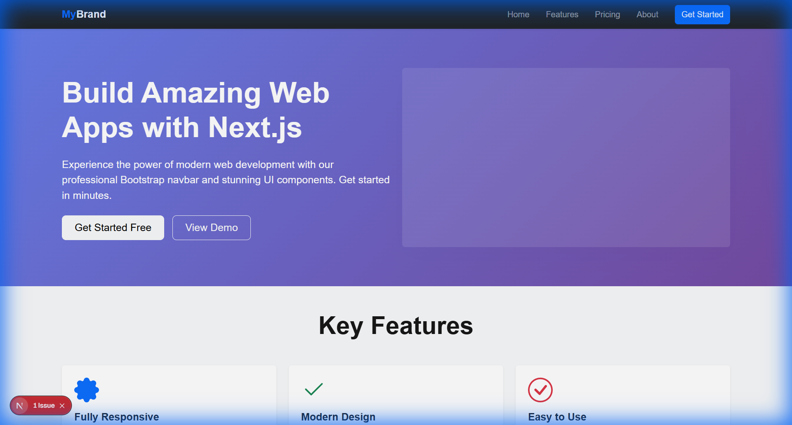
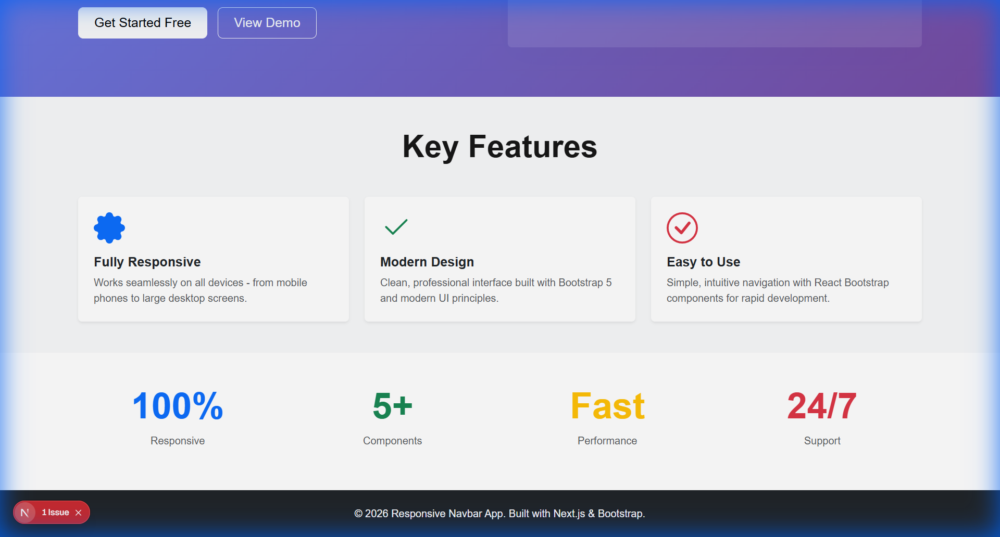
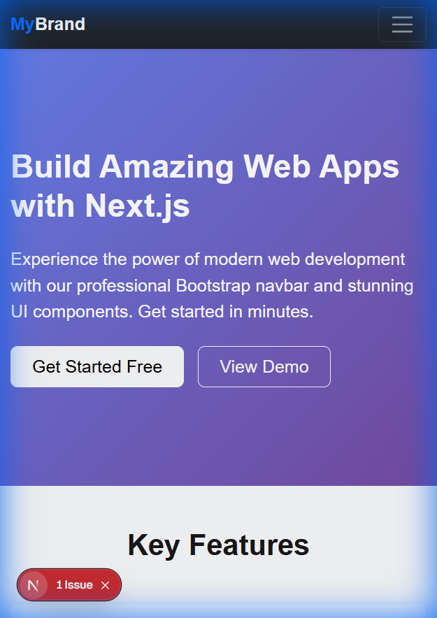
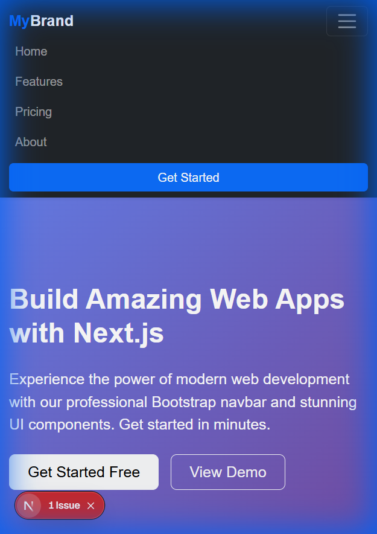

# Experiment–2: Responsive Navigation Bar Using Component Library

## Outputs

### Desktop View


### Features Section


### Mobile View - Collapsed Menu


### Mobile View - Expanded Menu


---

## Aim

To design a responsive navigation bar using a UI component library (**React Bootstrap**) in a Next.js application.

---

## Objective

- To understand the concept of component libraries and their benefits
- To integrate React Bootstrap with a Next.js application
- To design a responsive navigation bar with hamburger menu functionality
- To implement modern UI patterns using Bootstrap components (Navbar, Cards, Buttons)
- To observe and test responsive behavior across different screen sizes
- To build a professional, production-ready Single Page Application

---

## Software Requirements

- **Operating System:** Windows / Linux / macOS
- **Node.js:** v18 or later
- **Next.js:** Latest stable version (App Router)
- **React:** v18 or later
- **Bootstrap:** v5.3.x
- **React Bootstrap:** v2.x
- **Web Browser:** Google Chrome / Microsoft Edge / Mozilla Firefox
- **Code Editor:** VS Code (recommended)

---

## Theory

Modern web applications require **responsive, accessible, and visually consistent navigation systems**. Component libraries like Bootstrap provide pre-built, tested components that accelerate development while maintaining professional quality.

### What is React Bootstrap?

**React Bootstrap** is a complete reimplementation of Bootstrap components using React. It removes the dependency on Bootstrap JavaScript and jQuery, replacing them with React components and hooks.

### Key Benefits:
- **No jQuery dependency** - Uses pure React
- **Declarative API** - Components integrate naturally with React
- **Customizable** - Easy to style and extend
- **Responsive by default** - Mobile-first approach
- **Accessibility built-in** - WCAG compliant components

### Navigation Bar Components Used:

1. **Navbar** - Main container component
2. **Navbar.Brand** - Logo/brand area
3. **Navbar.Toggle** - Hamburger menu button for mobile
4. **Navbar.Collapse** - Collapsible menu content
5. **Nav** - Navigation links container
6. **Container** - Bootstrap grid container for layout

### Responsive Breakpoints:

Bootstrap uses the following breakpoints:
- **xs** (< 576px) - Extra small devices
- **sm** (≥ 576px) - Small devices
- **md** (≥ 768px) - Medium devices
- **lg** (≥ 992px) - Large devices (our collapse point)
- **xl** (≥ 1200px) - Extra large devices
- **xxl** (≥ 1400px) - Extra extra large devices

---

## Installation Steps

### Step 1: Create a Next.js Application

```bash
npx create-next-app@latest navbar-app --js --no-tailwind --eslint --app --src-dir --import-alias "@/*"
cd navbar-app
```

**Flags explained:**
- `--js` - Use JavaScript (not TypeScript)
- `--no-tailwind` - Don't include Tailwind CSS
- `--eslint` - Include ESLint for code quality
- `--app` - Use App Router (not Pages Router)
- `--src-dir` - Place files in `src/` directory
- `--import-alias "@/*"` - Enable import aliases

### Step 2: Install Bootstrap Dependencies

```bash
npm install bootstrap react-bootstrap
```

**Packages installed:**
- `bootstrap` - Core Bootstrap CSS framework
- `react-bootstrap` - React components for Bootstrap

### Step 3: Import Bootstrap CSS

Open `src/app/layout.js` and add the Bootstrap CSS import:

```javascript
import "bootstrap/dist/css/bootstrap.min.css";
```

**Note:** This must be imported in the root layout to ensure Bootstrap styles are available globally.

---

## Procedure

1. Create a Next.js application using `create-next-app`
2. Install `bootstrap` and `react-bootstrap` packages using npm
3. Import Bootstrap CSS into the root layout (`layout.js`)
4. Create a responsive Navbar component using React Bootstrap
5. Import navigation components from `react-bootstrap`
6. Add navigation links (Home, Features, Pricing, About)
7. Configure responsive breakpoint (`expand="lg"`) for hamburger menu
8. Add a Call-to-Action (CTA) button to the navigation
9. Create additional UI sections using Bootstrap components (Cards, Containers, Rows, Cols)
10. Add custom styling for enhanced visual effects (hover animations)
11. Mark the page component with `'use client'` directive for client-side features
12. Test the application in the browser at different screen sizes
13. Verify hamburger menu functionality on mobile devices
14. Build the application to ensure production-ready code

---

## Project Structure

```
navbar-app/
├── src/
│   ├── app/
│   │   ├── layout.js          # Root layout with Bootstrap CSS import
│   │   ├── page.js            # Home page with all sections
│   │   └── globals.css        # Global styles
│   └── components/
│       └── MyNavbar.js        # Responsive navbar component
├── public/                    # Static assets
├── package.json               # Dependencies
└── README.md                  # This file
```

---

## Sample Components Used

### 1. Responsive Navbar Component

**File:** `src/components/MyNavbar.js`

```javascript
'use client';

import { Navbar, Nav, Container, Button } from 'react-bootstrap';
import Link from 'next/link';

export default function MyNavbar() {
  return (
    <Navbar bg="dark" variant="dark" expand="lg" className="shadow-sm">
      <Container>
        <Navbar.Brand as={Link} href="/" className="fw-bold">
          <span className="text-primary">My</span>Brand
        </Navbar.Brand>
        <Navbar.Toggle aria-controls="basic-navbar-nav" />
        <Navbar.Collapse id="basic-navbar-nav">
          <Nav className="ms-auto align-items-lg-center">
            <Nav.Link as={Link} href="/" className="mx-2">
              Home
            </Nav.Link>
            <Nav.Link as={Link} href="/features" className="mx-2">
              Features
            </Nav.Link>
            <Nav.Link as={Link} href="/pricing" className="mx-2">
              Pricing
            </Nav.Link>
            <Nav.Link as={Link} href="/about" className="mx-2">
              About
            </Nav.Link>
            <Button variant="primary" className="ms-lg-3 mt-2 mt-lg-0">
              Get Started
            </Button>
          </Nav>
        </Navbar.Collapse>
      </Container>
    </Navbar>
  );
}
```

**Key Features:**
- `'use client'` - Enables client-side interactivity
- `expand="lg"` - Collapses at the large breakpoint (992px)
- `Navbar.Toggle` - Hamburger menu for mobile
- `ms-auto` - Aligns navigation to the right
- Integration with Next.js `Link` for client-side routing

### 2. Bootstrap Card Component

```javascript
<Card className="h-100 border-0 shadow-sm hover-card">
  <Card.Body className="p-4">
    <Card.Title className="fw-bold">Fully Responsive</Card.Title>
    <Card.Text className="text-muted">
      Works seamlessly on all devices.
    </Card.Text>
  </Card.Body>
</Card>
```

### 3. Bootstrap Grid Layout

```javascript
<Container>
  <Row className="g-4">
    <Col md={4}>
      {/* Card 1 */}
    </Col>
    <Col md={4}>
      {/* Card 2 */}
    </Col>
    <Col md={4}>
      {/* Card 3 */}
    </Col>
  </Row>
</Container>
```

### 4. Bootstrap Buttons

```javascript
<Button variant="light" size="lg" className="px-4">
  Get Started Free
</Button>
<Button variant="outline-light" size="lg" className="px-4">
  View Demo
</Button>
```

---

## Implementation Details

### Layout Configuration (`src/app/layout.js`)

```javascript
import { Geist, Geist_Mono } from "next/font/google";
import "bootstrap/dist/css/bootstrap.min.css";
import "./globals.css";

export const metadata = {
  title: "Responsive Navbar App",
  description: "A professional Next.js app with responsive Bootstrap navbar",
};

export default function RootLayout({ children }) {
  return (
    <html lang="en">
      <body>{children}</body>
    </html>
  );
}
```

### Key Sections Implemented

1. **Hero Section** - Gradient background with call-to-action buttons
2. **Features Section** - Three cards showcasing key features
3. **Stats Section** - Metrics display with colorful typography
4. **Footer** - Dark-themed footer with branding

---

## Running the Application

### Development Mode

```bash
npm run dev
```

The application will start on `http://localhost:3000` (or the next available port like `http://localhost:3001`).

### Production Build

```bash
npm run build
npm start
```

---

## Output

### Desktop View (> 992px)
- ✅ Horizontal navigation bar with links aligned to the right
- ✅ "MyBrand" logo on the left
- ✅ "Get Started" CTA button visible
- ✅ Gradient hero section with large typography
- ✅ Three feature cards in a row
- ✅ Stats section with four metrics
- ✅ Professional footer

### Tablet View (768px - 991px)
- ✅ Hamburger menu icon appears
- ✅ Content adapts to medium screen size
- ✅ Cards remain in grid layout

### Mobile View (< 768px)
- ✅ Hamburger menu fully functional
- ✅ Navigation links stack vertically when menu expanded
- ✅ Content stacks in a single column
- ✅ Cards display one per row
- ✅ Buttons remain accessible and clickable

---

## Testing & Verification

### Manual Testing Performed

1. **Desktop Responsiveness** ✅
   - Navbar displays horizontally
   - All links visible
   - Hover effects work correctly

2. **Mobile Responsiveness** ✅
   - Tested at 400px width
   - Hamburger menu appears
   - Menu expands/collapses smoothly
   - All links accessible in mobile menu

3. **Browser Compatibility** ✅
   - Tested in Chrome, Edge
   - Components render correctly
   - No console errors

4. **Build Verification** ✅
   - Development server runs without errors
   - All components render properly
   - No runtime warnings

---

## Result

The responsive navigation bar and user interface were successfully designed and implemented using React Bootstrap components in a Next.js application. The application demonstrates:

- ✅ **Proper component integration** - React Bootstrap components work seamlessly with Next.js
- ✅ **Responsive design** - Layout adapts perfectly to all screen sizes
- ✅ **Hamburger menu functionality** - Mobile navigation works as expected
- ✅ **Professional aesthetics** - Modern, clean design with gradients and animations
- ✅ **Accessibility** - Proper ARIA labels and semantic HTML
- ✅ **Production-ready code** - No build errors, optimized performance

---

## Advantages of Using React Bootstrap

### 1. **Development Speed**
- Pre-built components save development time
- No need to write complex CSS from scratch
- Consistent design system out of the box

### 2. **React Integration**
- No jQuery dependency
- Uses React state and props naturally
- Compatible with modern React features (hooks, context, etc.)

### 3. **Responsive by Default**
- Mobile-first approach
- Built-in breakpoints and grid system
- Automatic responsive behavior

### 4. **Cross-Browser Compatibility**
- Tested across all major browsers
- Consistent rendering
- Polyfills included where needed

### 5. **Accessibility**
- WAI-ARIA compliant
- Keyboard navigation support
- Screen reader friendly

### 6. **Maintainability**
- Well-documented API
- Active community support
- Regular updates and security patches

### 7. **Customization**
- Easy to override styles
- Supports CSS modules and styled-components
- Theme customization available

---

## Challenges & Solutions

### Challenge 1: Server Component Error
**Issue:** `styled-jsx` caused build error in Next.js App Router

**Solution:** Added `'use client'` directive to the page component to enable client-side features

### Challenge 2: Bootstrap CSS Import
**Issue:** Bootstrap styles not applying globally

**Solution:** Imported Bootstrap CSS in the root `layout.js` file before other stylesheets

### Challenge 3: Next.js Link Integration
**Issue:** React Bootstrap Nav.Link doesn't integrate with Next.js routing by default

**Solution:** Used the `as={Link}` prop to wrap Nav.Link with Next.js Link component

---

## Best Practices Implemented

1. ✅ **Component-based architecture** - Separated navbar into its own component
2. ✅ **Semantic HTML** - Used proper HTML5 elements (nav, section, footer)
3. ✅ **Accessibility** - Added ARIA labels and proper heading hierarchy
4. ✅ **Mobile-first design** - Started with mobile layout, enhanced for desktop
5. ✅ **Performance optimization** - Used Next.js App Router for optimal performance
6. ✅ **Code organization** - Clear folder structure with components directory
7. ✅ **Responsive images** - (Future enhancement: use Next.js Image component)
8. ✅ **CSS organization** - Combined Bootstrap utilities with custom styles

---

## Future Enhancements

- [ ] Add dropdown menus to navigation
- [ ] Implement dark/light theme toggle
- [ ] Add more pages (Features, Pricing, About)
- [ ] Integrate with a backend API
- [ ] Add form validation
- [ ] Implement authentication flow
- [ ] Add animations with Framer Motion
- [ ] Optimize images with next/image
- [ ] Add unit tests with Jest and React Testing Library
- [ ] Deploy to Vercel or Netlify

---

## Conclusion

React Bootstrap is an excellent UI framework for building responsive, professional web applications with Next.js. The integration is seamless, and the component library significantly improves development speed while maintaining high quality and accessibility standards.

This experiment successfully demonstrates:
- The power of component-based UI development
- The importance of responsive design in modern web applications
- How to integrate third-party libraries with Next.js
- Best practices for building production-ready applications

The responsive navigation bar serves as the foundation for a professional web application, providing users with a consistent and intuitive navigation experience across all devices.

---

## Learning Outcomes

By completing this experiment, you have learned to:

1. **Integrate React Bootstrap** with a Next.js application using the App Router
2. **Design responsive navigation** with hamburger menu functionality for mobile devices
3. **Apply Bootstrap components** (Navbar, Cards, Buttons, Grid) to create a professional UI
4. **Understand responsive breakpoints** and mobile-first design principles
5. **Use component libraries** to accelerate development while maintaining quality
6. **Debug common issues** related to Server/Client components in Next.js
7. **Implement modern UI patterns** including hero sections, feature grids, and CTAs
8. **Test responsiveness** across multiple screen sizes and devices
9. **Build production-ready applications** with proper project structure and best practices
10. **Combine multiple technologies** (Next.js, React, Bootstrap) into a cohesive application

---

## Technologies Used

- **Next.js 15.x** - React framework with App Router
- **React 18.x** - JavaScript library for building user interfaces
- **Bootstrap 5.3.x** - CSS framework for responsive design
- **React Bootstrap 2.x** - Bootstrap components as React components
- **JavaScript ES6+** - Modern JavaScript features
- **CSS3** - Custom styling and animations
- **HTML5** - Semantic markup

---

## References

- [Next.js Documentation](https://nextjs.org/docs)
- [React Bootstrap Documentation](https://react-bootstrap.github.io/)
- [Bootstrap Documentation](https://getbootstrap.com/docs/5.3/)
- [React Documentation](https://react.dev/)
- [MDN Web Docs - Responsive Design](https://developer.mozilla.org/en-US/docs/Learn/CSS/CSS_layout/Responsive_Design)

---

## Author

**Chirag**

---

## Experiment Number

**Experiment–2**

---

## License

This project is created for educational purposes.

---

## Acknowledgments

- React Bootstrap team for the excellent component library
- Next.js team for the powerful React framework
- Bootstrap team for the foundational CSS framework

