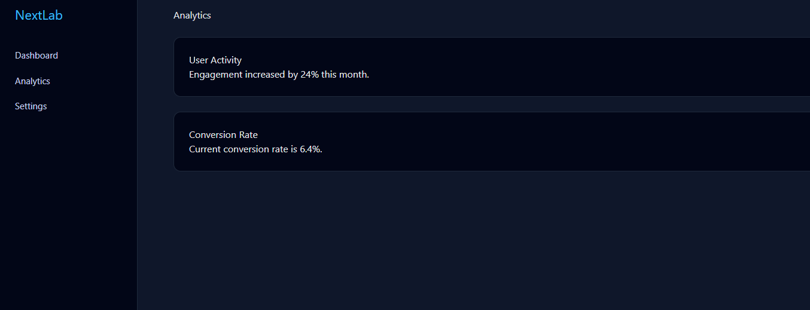
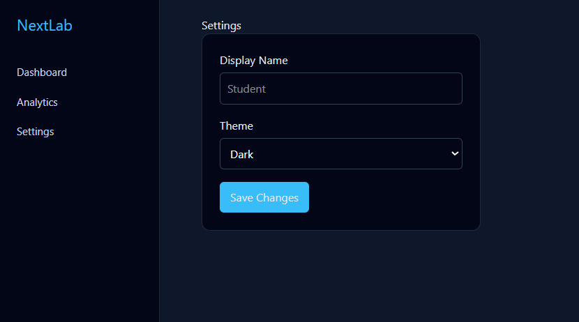

# Next.js SPA Routing Dashboard (TypeScript)

This project demonstrates **client-side routing in a Single Page
Application** using **Next.js App Router with TypeScript**, enhanced
with a professional dashboard-style UI.

------------------------------------------------------------------------

## 🎯 Aim

To implement SPA routing and navigation without page reload using
Next.js native routing.

------------------------------------------------------------------------

# Screeshots




## 🧰 Software Requirements

-   Node.js 18+
-   Next.js 14+
-   TypeScript
-   VS Code
-   Web Browser

------------------------------------------------------------------------

## 📂 Folder Structure

    next-routing-lab/
    ├── app/
    │   ├── layout.tsx
    │   ├── page.tsx
    │   ├── about/page.tsx
    │   ├── contact/page.tsx
    ├── components/
    │   └── Navbar.tsx

------------------------------------------------------------------------

## 🚀 Installation

``` bash
npx create-next-app@latest next-routing-lab --typescript
cd next-routing-lab
npm run dev
```

------------------------------------------------------------------------

## ▶️ Run the Project

Open:

http://localhost:3000

Use the sidebar to navigate between Dashboard, Analytics, and Settings
pages.

------------------------------------------------------------------------

## 📘 Theory

Next.js App Router uses **file-based routing**.\
Each folder inside the `app/` directory becomes a route.

Navigation is handled through:

-   `next/link`
-   Client components

This enables seamless SPA-style transitions without full page reload.

------------------------------------------------------------------------

## 🧪 Experiment Outcomes

-   Implemented multi-page routing
-   Created immersive dashboard UI
-   Sidebar navigation
-   Analytics panels
-   Settings form
-   Professional layout

------------------------------------------------------------------------

## ❓ Viva Questions

1.  How does routing work in Next.js?
2.  What replaces React Router in Next.js?
3.  What is App Router?
4.  What component enables client navigation?
5.  Difference between SSR and CSR?

------------------------------------------------------------------------

## 📌 Conclusion

This experiment demonstrates how Next.js provides a robust routing
system for building Single Page Applications with enterprise-style user
interfaces.

------------------------------------------------------------------------

Happy Coding 🚀
