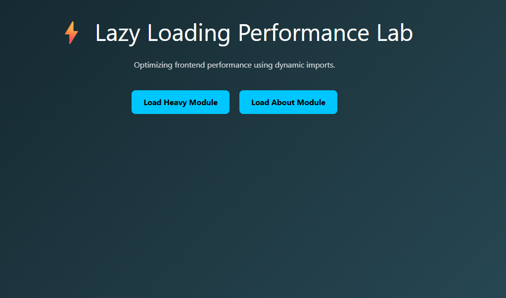
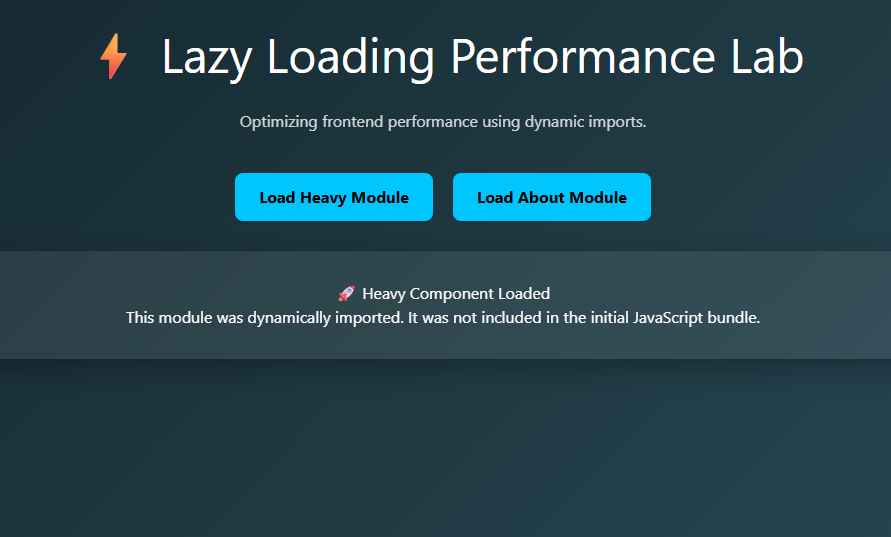

# Experiment 5 -- Next.js Lazy Loading and Performance Optimization

------------------------------------------------------------------------

## Overview

This experiment demonstrates the implementation of Lazy Loading and
Dynamic Imports within a Next.js (App Router) application to build a
high-performance, modern, and optimized frontend interface.

The objective is to familiarize students with real-world performance
optimization techniques and illustrate how code-splitting improves
scalability, load time, and user experience in professional web
applications.

------------------------------------------------------------------------

## Aim

To design and implement a performance-optimized Next.js application
using Dynamic Imports and Lazy Loading, focusing on frontend performance
enhancement and modular architecture.

------------------------------------------------------------------------

## Concepts Covered

### 1. Dynamic Imports (`next/dynamic`)

Used to load heavy components only when required instead of including
them in the initial bundle.

### 2. Code Splitting

Splits JavaScript bundles into smaller chunks that load on demand.

### 3. Lazy Loading

Loads modules only after user interaction.

### 4. Loading Fallback UI

Displays a loading indicator while a module is being fetched.

### 5. Hydration Safety

Ensures no server-client rendering mismatches occur.

### 6. Animated UI (Glassmorphism Design)

Enhances user experience with modern UI effects.

------------------------------------------------------------------------

## Technologies Used

-   Next.js (App Router)
-   React
-   TypeScript
-   Dynamic Imports
-   CSS Animations

------------------------------------------------------------------------

## Learning Objectives

-   Understand frontend performance optimization.
-   Implement dynamic module loading in Next.js.
-   Apply lazy loading techniques.
-   Improve initial load performance.
-   Manage UI state efficiently.

------------------------------------------------------------------------

## Learning Outcomes

-   Design optimized frontend architectures.
-   Reduce initial bundle size.
-   Analyze performance improvements.
-   Evaluate lazy loading impact.
-   Create scalable web applications.

------------------------------------------------------------------------

## Bloom's Taxonomy Mapping

-   Apply (L3)
-   Analyze (L4)
-   Evaluate (L5)
-   Create (L6)

------------------------------------------------------------------------

## Procedure

1.  Create a Next.js application using TypeScript.
2.  Implement dynamic imports using `next/dynamic`.
3.  Create heavy components to simulate real-world modules.
4.  Add loading fallback UI.
5.  Test dynamic chunk loading via Developer Tools → Network tab.
6.  Validate performance optimization.

------------------------------------------------------------------------

## Result

A fully functional Next.js application demonstrating Lazy Loading and
Dynamic Imports was successfully developed. The application loads heavy
modules only upon user interaction, reducing initial load time and
improving performance.

------------------------------------------------------------------------

## Conclusion

Lazy Loading and Dynamic Imports significantly enhance frontend
performance in Next.js applications. This experiment demonstrates how
modern web applications can be optimized using modular architecture and
on-demand loading strategies.

------------------------------------------------------------------------

## Author

Chirag

------------------------------------------------------------------------

## License

Educational Use Only
