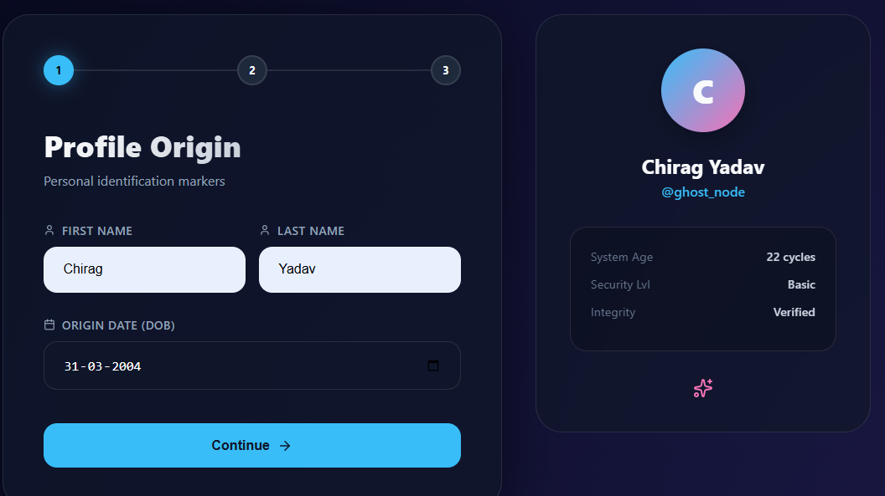
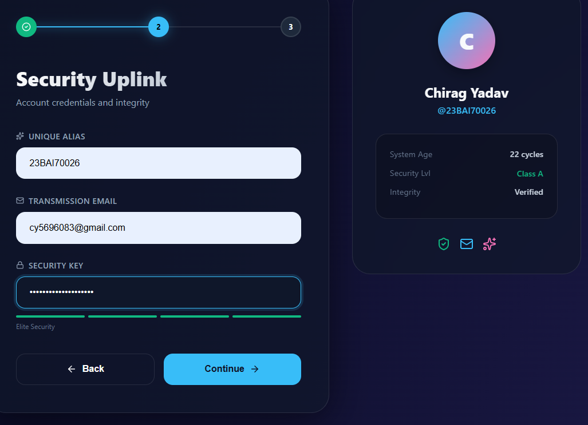
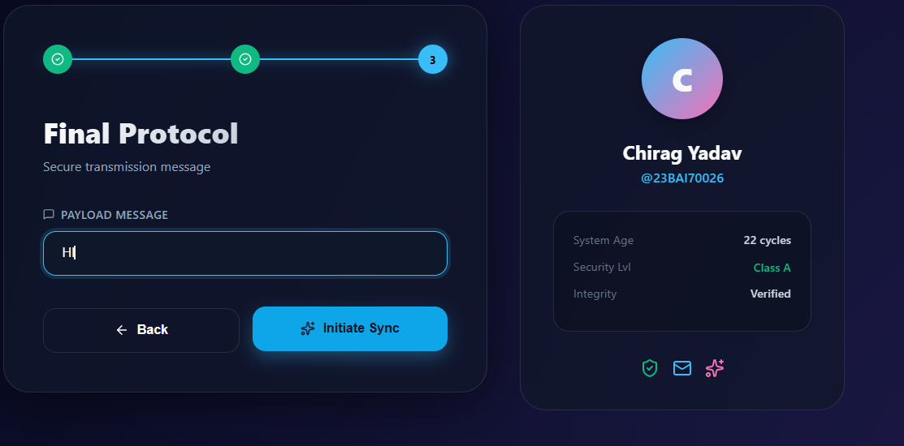
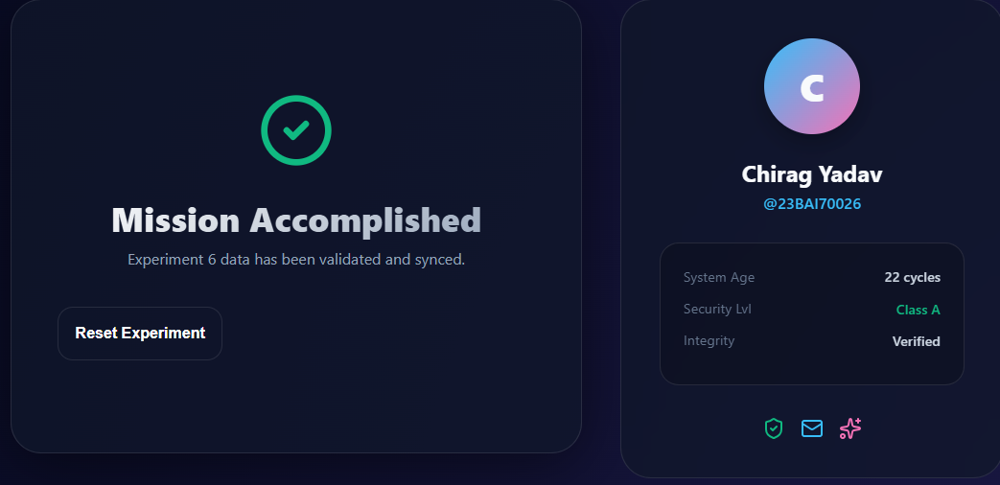
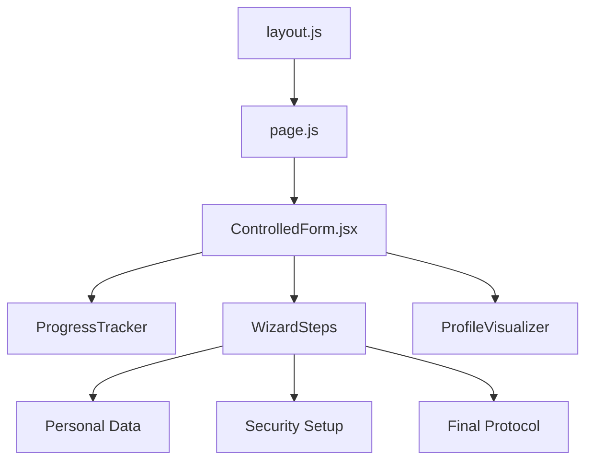
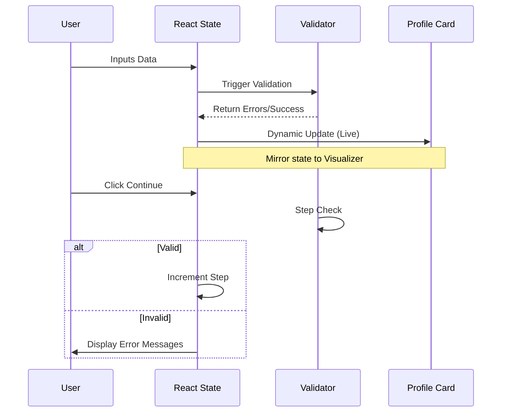

# Laboratory Report: Experiment 6
**Course:** Fullstack Development - II  
**Topic:** Handling Forms Using Controlled Components & Client-Side Validation  
**Date:** February 24, 2026

---

# UI Design & Implementation Screenshots









## 1. Aim
To design and implement a React/Next.js application that handles user input via **Controlled Components** and performs robust **Client-Side Validation** before final data synchronization.

## 2. Software Requirements
- **Runtime Environment**: Node.js (v18.0+)
- **Framework**: Next.js 15 (App Router)
- **Library**: React 19
- **Styling**: Vanilla CSS (Modern CSS3 with Variables & Grid)
- **Animation**: Framer Motion
- **Iconography**: Lucide React

## 3. Theory
### 3.1 Controlled Components
In React, a controlled component is one where the form data is handled by the component's state (`useState`). The "single source of truth" remains the React state, ensuring that the UI and the data model are always in sync.

### 3.2 Client-Side Validation
Validation performed in the browser allows for immediate feedback to the user, reducing unnecessary server requests and improving the User Experience (UX).

## 4. Procedure
1. **Setup**: Initialize a Next.js environment using `create-next-app`.
2. **State Modeling**: Create a centralized object state to track multiple input fields (FirstName, LastName, DoB, Email, Alias, Password).
3. **Validation Logic**: Implement regex-based validation for emails and mathematical calculations for age verification (18+).
4. **Guard Implementation**: Develop a strict change-handler to intercept and block future-dated inputs using browser alerts.
5. **Premium Integration**: Incorporate a multi-step "Wizard" flow and a real-time "Profile Visualizer" to display state data dynamically.
6. **Submission**: Simulate an asynchronous API lifecycle using `setTimeout` to handle loading and success states.

## 5. Implementation Highlights
### 5.1 Validation Rules
- **Username/Alias**: Minimum 3 characters.
- **Names**: Minimum 2 characters.
- **Email**: Strict validation blocking non-standard special characters; whitelists verified domains (com, edu, ac.in, etc.).
- **Date of Birth**: Restricted to $\leq$ Current Date; calculated age must be $\geq$ 18.
- **Password**: 4-point complexity scoring system (Casing, Numbers, Symbols, Length).

### 5.2 Key Code Architecture
```javascript
// Universal Change Handler with Future-Date Guard
const handleChange = (e) => {
  const { name, value } = e.target;
  if (name === 'dob' && new Date(value) > new Date()) {
    alert('Date of birth cannot be in the future!');
    return;
  }
  setFormData(prev => ({ ...prev, [name]: value }));
};
```

## 6. System Architecture & UI Flow
The following Mermaid diagrams illustrate the component hierarchy and the logical state flow of the multi-step application.

### 6.1 Component Hierarchy


### 6.2 Data Flux & Validation Flow


## 7. Visual Interface Overview
*The following sections describe the visual states of the implemented application.*

### 7.1 Protocol 01: Profile Origin
- **Primary Interface**: A central glassmorphism card with a deep indigo background. 
- **User Inputs**: 'First Name' and 'Last Name' arranged in a responsive grid. 
- **Live Feedback**: As the user types, the 'Digital ID' card on the right-hand side updates its avatar with the first letter of the First Name.

### 7.2 Protocol 02: Security Uplink
- **Password Integrity**: Features a dynamic 4-segment strength meter. 
- **Behavior**: Shifts color dynamically (Red -> Amber -> Emerald) as complex characters are added. 
- **Visualizer Update**: Displays 'Verified' or 'Flagged' status based on input integrity.

### 7.3 Submission Protocol (Mock API)
- **Transition**: Upon initiation, the form is replaced by a translucent 'Processing' overlay.
- **Micro-Interaction**: A high-speed CSS spinner indicates data synchronization.
- **Conclusion**: A success screen emerges with a neon green checkmark and a system reset option.

## 8. Features & Observations
| Feature | Observation |
|:---|:---|
| **Multi-Step Flow** | Improves focus by categorizing 7+ inputs into 3 logical steps. |
| **Live Visualizer** | Provides instant visual gratification as state updates are mirrored on a "Digital ID" card. |
| **Micro-Animations** | Framer Motion provides sliding transitions that eliminate sudden UI jumps between steps. |
| **Error Handling** | Real-time highlighting of invalid fields prevents "blind" submission errors. |

## 7. Results
The application successfully demonstrates the management of complex form states in a React environment. The integration of client-side validation logic effectively prevents the submission of erroneous or incomplete datasets, while the premium UI enhancements significantly improve user engagement compared to standard HTML forms.

## 8. Conclusion
Controlled components remain the gold standard for form handling in React due to their predictability and ease of testing. This experiment successfully combined core React principles with modern animation libraries to create a sophisticated, validated, and user-centric web interface.

---
**Author:** Chirag Yadav
**Date:** 24th February 2026

License: MIT