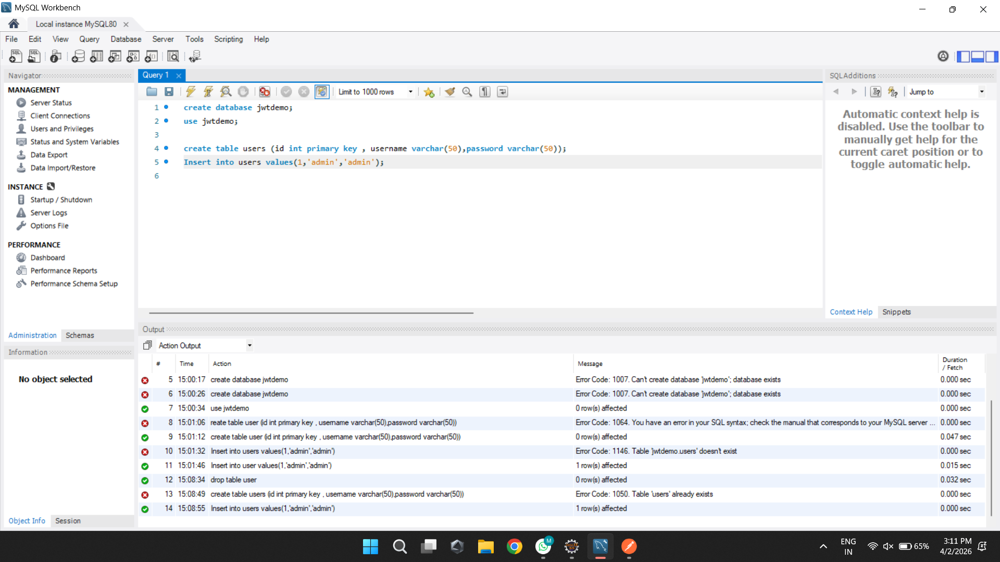
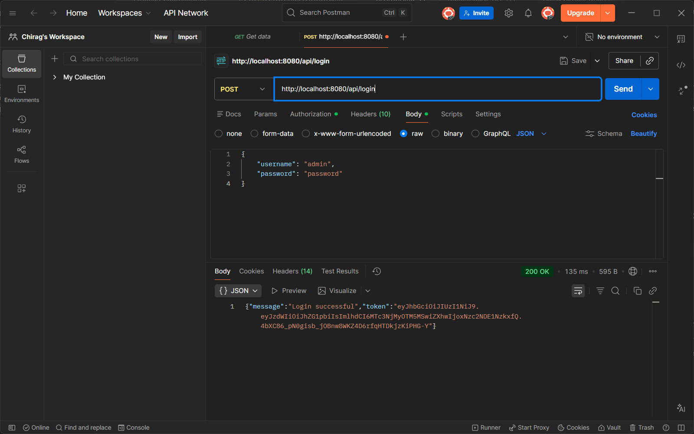
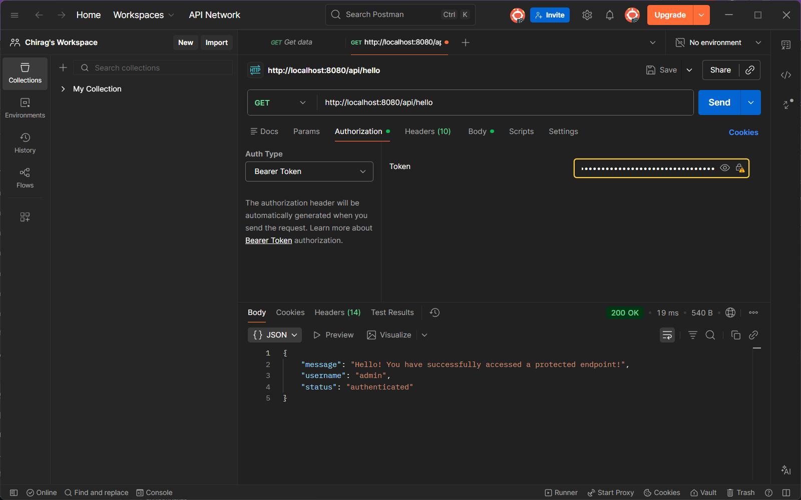

# Experiment 9: Implementing JWT Authentication and Security in Spring Boot

**Author:** Chirag

This repository demonstrates the implementation of **JSON Web Token (JWT)** based authentication and authorization using **Spring Security**. The application ensures secure access to REST endpoints by validating signed tokens and interacting with a database for user credential verification.

---

## Table of Contents
1. [Objectives](#objectives)
2. [Tech Stack](#tech-stack)
3. [Project Structure](#project-structure)
4. [Database Setup](#database-setup)
5. [JWT Implementation](#jwt-implementation)
6. [API Testing - Login and Token Generation](#api-testing---login-and-token-generation)
7. [API Testing - Accessing Protected Resources](#api-testing---accessing-protected-resources)
8. [How to Run](#how-to-run)
9. [API Endpoints](#api-endpoints)
10. [Key Learnings](#key-learnings)

---

## Objectives

- To understand the architecture of **JWT (JSON Web Token)**.
- To configure **Spring Security** for stateless authentication.
- To implement a login system that generates a secure JWT upon successful credential validation.
- To secure specific API endpoints and validate tokens in incoming requests.
- To integrate **Spring Data JPA** with MySQL for persistent user storage.

---

## Tech Stack

| Tool / Technology | Purpose |
|---|---|
| Java 17, Spring Boot 3.2.0 | Application framework |
| Spring Security | Authentication and authorization |
| io.jsonwebtoken (jjwt) 0.11.5 | JWT generation and validation |
| MySQL / H2 (in-memory) | User credential storage |
| BCryptPasswordEncoder | Secure password hashing |
| Postman | API testing |
| Maven | Build tool |

---

## Project Structure

```
src/main/java/com/example/jwtdemo/
+-- config/
|   +-- DataInitializer.java         # Seeds sample users on startup
|   +-- SecurityConfig.java          # Spring Security filter chain
+-- controller/
|   +-- AuthController.java          # /api/login, /api/register
|   +-- TestController.java          # /api/hello (protected), /api/public/info
+-- model/
|   +-- User.java                    # JPA entity implementing UserDetails
+-- repository/
|   +-- UserRepository.java          # JPA repository for user operations
+-- security/
|   +-- JwtAuthenticationFilter.java # Validates JWT on every incoming request
|   +-- JwtUtil.java                 # Token generation, parsing, validation
+-- service/
|   +-- AuthService.java             # Credential validation and registration
+-- JwtDemoApplication.java          # Spring Boot main entry point
```

---

## Database Setup

The application uses a database named `jwtdemo`. The `users` table stores `id`, `username`, `password` (BCrypt-hashed), and `role`. On startup with H2, `DataInitializer` automatically seeds two sample users.

### Screenshot 1 - MySQL Workbench: Creating the `jwtdemo` Database and `users` Table



> **Description:** The screenshot shows the SQL commands executed in **MySQL Workbench** to set up the database schema:
> - `CREATE DATABASE jwtdemo` - creates the application database
> - `USE jwtdemo` - switches to the new database
> - `CREATE TABLE users (id int primary key, username varchar(50), password varchar(50))` - defines the users table
> - `INSERT INTO users VALUES(1,'admin','admin')` - inserts a sample admin user
>
> The **Action Output** panel at the bottom displays the execution log, showing both errors (e.g., database already exists) and successes (`1 row(s) affected`). This confirms the database is correctly initialized before running the Spring Boot application.

**Pre-seeded users available on startup (H2 mode):**

| Username | Password | Role  |
|----------|----------|-------|
| `admin`  | `password` | ADMIN |
| `user`   | `password` | USER  |

---

## JWT Implementation

### Key Components

#### `JwtUtil`
- Generates signed JWT tokens using the **HS256** algorithm
- Reads `jwt.secret` and `jwt.expiration` from `application.properties`
- Extracts claims (username, expiry date) and validates token integrity
- Token expiration is set to **24 hours** (86400000 ms)

#### `JwtAuthenticationFilter`
- Extends `OncePerRequestFilter` - runs exactly once per HTTP request
- Reads the `Authorization: Bearer <token>` header from incoming requests
- Validates the token signature and expiry, then sets authentication in `SecurityContextHolder`
- Constructed via constructor injection to avoid Spring circular dependency issues

#### `SecurityConfig`
- Disables CSRF protection (stateless REST API does not use cookies/sessions)
- Sets session creation policy to `STATELESS`
- Permits `/api/login` and `/api/register` without any authentication
- All other routes require a valid JWT token

#### `AuthService`
- Implements `UserDetailsService` - loads user details from the database by username
- Validates credentials using `BCryptPasswordEncoder.matches()` (no plain text comparison)
- Returns a signed JWT token on successful authentication
- Supports user registration with automatic password hashing

---

## API Testing - Login and Token Generation

A `POST` request is sent to `/api/login` with a JSON body containing `username` and `password`. On successful credential validation, the server returns a signed JWT token that the client must store and use for subsequent requests.

### Screenshot 2 - Postman: POST `/api/login` - Successful Authentication



> **Description:** The screenshot shows **Postman** (Chirag's Workspace) sending a POST request to `http://localhost:8080/api/login`:
>
> - **Method:** POST
> - **URL:** `http://localhost:8080/api/login`
> - **Body tab:** `raw` selected, format set to `JSON`
> - **Request payload:**
>   ```json
>   {
>     "username": "admin",
>     "password": "password"
>   }
>   ```
>
> The **Response panel** at the bottom shows **200 OK** (135 ms, 595 B), confirming successful authentication. The response body contains:
> ```json
> {
>   "message": "Login successful",
>   "token": "eyJhbGciOiJIUzI1NiJ9.eyJzdWIiOiJhZG1pbi..."
> }
> ```
> The `token` value is the signed JWT that must be copied and included in the `Authorization` header for all protected endpoint requests.

---

## API Testing - Accessing Protected Resources

After obtaining the JWT from the login step, it is passed as a **Bearer Token** in the `Authorization` header. A `GET` request to `/api/hello` verifies that the server correctly validates the token and grants access to the protected resource.

### Screenshot 3 - Postman: GET `/api/hello` - Accessing a Protected Endpoint



> **Description:** The screenshot shows **Postman** sending a GET request to `http://localhost:8080/api/hello`:
>
> - **Method:** GET
> - **URL:** `http://localhost:8080/api/hello`
> - **Authorization tab** is open with:
>   - **Auth Type:** Bearer Token
>   - **Token field:** the JWT copied from the login response (shown as masked dots)
>
> The **Response panel** shows **200 OK** (19 ms, 540 B), confirming the token was validated successfully. The response body contains:
> ```json
> {
>   "message": "Hello! You have successfully accessed a protected endpoint!",
>   "username": "admin",
>   "status": "authenticated"
> }
> ```
> The server extracted the `username` field directly from the JWT claims without any database session lookup, demonstrating true **stateless authentication**. The `JwtAuthenticationFilter` validated the token signature and set the security context before the request reached the controller.

---

## How to Run

### Prerequisites
- Java 17 or higher
- Maven 3.6 or higher

### Steps

1. **Run with H2 in-memory database (no MySQL required):**
   ```bash
   mvn spring-boot:run
   ```

2. **Application starts at:** `http://localhost:8080`

3. **H2 Console** (view database in browser): `http://localhost:8080/h2-console`
   - JDBC URL: `jdbc:h2:mem:jwtdb`
   - Username: `sa`
   - Password: *(leave blank)*

4. **To switch to MySQL**, update `src/main/resources/application.properties`:
   ```properties
   spring.datasource.url=jdbc:mysql://localhost:3306/jwtdemo
   spring.datasource.username=root
   spring.datasource.password=your_password
   spring.datasource.driver-class-name=com.mysql.cj.jdbc.Driver
   spring.jpa.properties.hibernate.dialect=org.hibernate.dialect.MySQLDialect
   spring.jpa.hibernate.ddl-auto=update
   ```
   Then run the database script:
   ```bash
   mysql -u root -p < database/setup.sql
   ```

---

## API Endpoints

| Method | Endpoint | Auth Required | Description |
|--------|----------|:---:|-------------|
| `POST` | `/api/login` | No | Authenticate with credentials, receive JWT |
| `POST` | `/api/register` | No | Register a new user account |
| `GET` | `/api/hello` | **Yes** | Protected endpoint - returns greeting with username |
| `GET` | `/api/public/info` | No | Public endpoint - no token needed |

### How to Use the Token in Postman

1. Send `POST /api/login` with JSON body `{"username":"admin","password":"password"}`
2. Copy the `token` value from the response
3. For protected endpoints, go to the **Authorization tab**, select **Bearer Token**, and paste the token

---

## Key Learnings

- **Stateless Authentication** - JWT removes the need for server-side session storage, making the API scalable across multiple servers
- **Spring Security Filters** - `OncePerRequestFilter` intercepts every HTTP request to validate tokens before they reach any controller
- **Token Lifecycle** - Tokens are signed with HS256, carry expiry claims, and are fully validated on every protected request
- **BCrypt Hashing** - Passwords are never stored or compared in plain text; `PasswordEncoder.matches()` safely compares BCrypt hashes
- **Circular Dependency Resolution** - `JwtAuthenticationFilter` is instantiated as a `@Bean` in `SecurityConfig` using constructor injection, cleanly breaking the Spring circular dependency cycle

---

**Author:** Chirag
**Last Updated:** April 2026