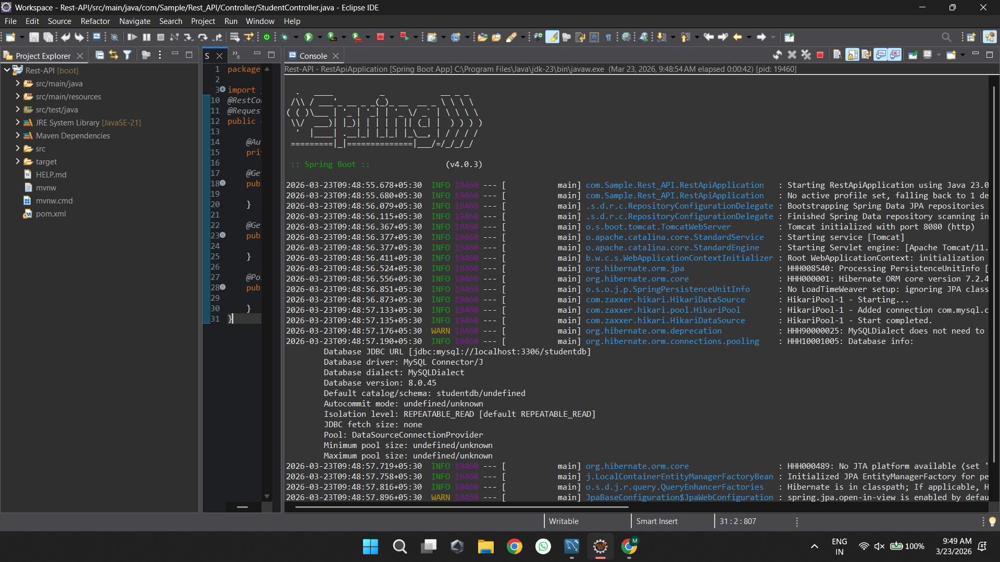
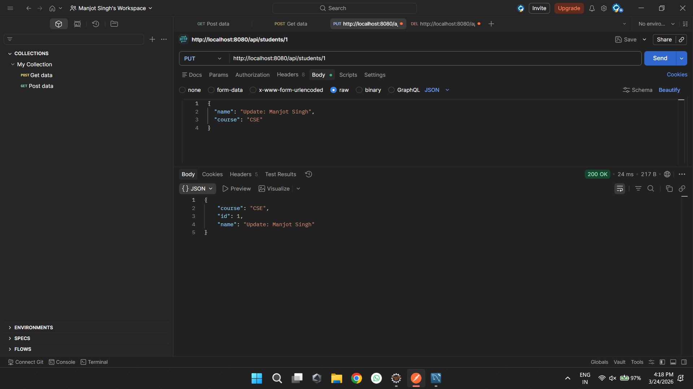
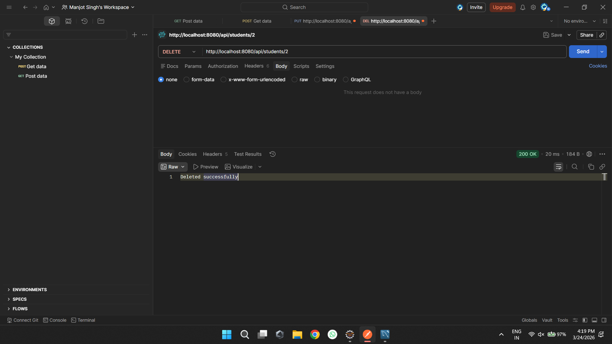

# Experiment 8: Building a REST API Using Spring Boot

This repository demonstrates the end-to-end development of a **RESTful API** capable of handling CRUD operations using **Spring Boot**. The service interacts with a **MySQL** database for persistence and has been thoroughly tested via endpoints using **Postman**.

---

## 🎯 Objectives
- To understand the fundamental concepts of RESTful Web Services.
- To configure and initialize a Spring Boot application using STS/Eclipse.
- To connect a Spring Boot Application to a Relational Database (MySQL) using Spring Data JPA.
- To expose robust API endpoints (`GET`, `POST`, `PUT`, `DELETE`) capable of transmitting JSON data.
- To consume and test the generated API endpoints efficiently utilizing Postman.

---

## 🛠️ Tech Stack & Tools Used
- **Language / Framework:** Java, Spring Boot
- **IDE:** Eclipse/VSCode (Spring Tools Suite Integration)
- **Database:** MySQL Server
- **API Testing tool:** Postman

---

## 🗂️ Step-by-Step Implementation & Execution Sequence

Below is a detailed walkthrough of the implementation structure mapped with terminal logs and expected outputs:

### 1. Database Setup & Initialization in MySQL
To persist our data, a schema (`student`) and corresponding tables are generated in MySQL. This layout acts as the primary data store where our API will perform database interactions. In this step, the schema structure has mapping equivalent to our Java Entities.

*Figure 1: Viewing the configured student database and data fields in the MySQL Workbench environment.*

---

### 2. Service Implementation & Codebase in Eclipse
The application uses standard Spring Boot annotations:
- `@RestController` to define the class as a request handler.
- `@RequestMapping` and `@GetMapping`/`@PostMapping` to route URL requests.
- `@Autowired` to bind the Repository interface to the Controller.

*Figure 2: Snippet of the controller/service configurations within the Eclipse IDE environment.*

---

### 3. Application Execution & Server Startup
Once the `application.properties` (defining the database URL, credentials, and Hibernate dialect) and code structure are confirmed, we run the Spring Boot Main class. Spring Boot starts its embedded Tomcat Server (typically on port `8080`) and connects to the MySQL source.

*Figure 3: Console logs showing a successful Spring Boot application deployment and active MySQL HikariPool connection.*

---

### 4. API Testing: Client 'POST' Requests via Postman
We test the robustness of our API utilizing Postman. By configuring the URL (e.g., `http://localhost:8080/api/students`), generating a JSON body, and setting the HTTP method to **POST**, we insert new records dynamically into the database.

*Figure 4: A valid JSON payload payload submitted via Postman POST method triggering a 200 OK / 201 Created Status.*

---

### 5. API Testing: Data Verification via Postman
Following up the `POST` request, subsequent API checks (such as using the **GET** method on the same URL endpoint) verify that the data has been successfully securely transferred and saved to the database.

*Figure 5: Postman verifying data modifications through GET/POST payload checks detailing the updated state of our data source.*

---

### 6. API Testing: Updating Data via PUT Request in Postman
Using the **PUT** method on `http://localhost:8080/api/students/{id}`, we send an updated JSON body to modify an existing student record. The server processes the request and returns the updated entity confirming the changes.

*Figure 6: Postman PUT request updating an existing student record with modified JSON payload.*

---

### 7. API Testing: Deleting Data via DELETE Request in Postman
Using the **DELETE** method on `http://localhost:8080/api/students/{id}`, we remove a specific student record from the database. The server responds with a success message confirming the deletion.

*Figure 7: Postman DELETE request removing a student record and returning a confirmation response.*

---

## 💡 Key Learnings
- **Spring Initializr:** Making project setup seamless and straightforward.
- **RESTful Methodologies:** Proper alignment between HTTP verbs (`GET`, `POST`) and entity state transitions.
- **Spring Data JPA:** Abstracting pure SQL syntax behind simple Java native interface methods.
- **Dependency Injections:** Auto-wiring components effortlessly reducing boilerplate.
