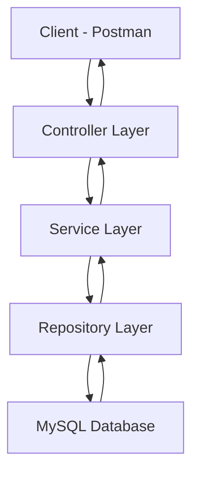
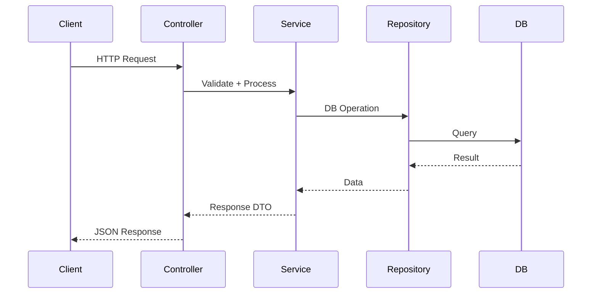

# Laboratory Report: Experiment 8  
**Course:** Fullstack Development - II  
**Topic:** Production-Grade REST API using Spring Boot (Layered Architecture)  
**Date:** March 2026  

---

## 1. Aim
To design and implement a **scalable, production-grade REST API** using Spring Boot following a **multi-layer architecture (Controller → Service → Repository)** with proper **validation and exception handling**.

---

## 2. Architecture Overview



---

## 3. Request Flow



---

## 4. Layered Implementation

### 4.1 Controller Layer
Handles HTTP requests and responses.

```java
@RestController
@RequestMapping("/api/users")
public class UserController {

    @Autowired
    private UserService userService;

    @GetMapping
    public List<User> getUsers() {
        return userService.getAllUsers();
    }

    @GetMapping("/{id}")
    public User getUser(@PathVariable int id) {
        return userService.getUserById(id);
    }

    @PostMapping
    public User createUser(@RequestBody @Valid User user) {
        return userService.createUser(user);
    }

    @PutMapping("/{id}")
    public User updateUser(@PathVariable int id, @RequestBody User user) {
        return userService.updateUser(id, user);
    }

    @DeleteMapping("/{id}")
    public String deleteUser(@PathVariable int id) {
        userService.deleteUser(id);
        return "User deleted successfully";
    }
}
```

---

### 4.2 Service Layer
Contains business logic.

```java
@Service
public class UserService {

    @Autowired
    private UserRepository repo;

    public List<User> getAllUsers() {
        return repo.findAll();
    }

    public User getUserById(int id) {
        return repo.findById(id)
            .orElseThrow(() -> new RuntimeException("User not found"));
    }

    public User createUser(User user) {
        return repo.save(user);
    }

    public User updateUser(int id, User user) {
        User existing = getUserById(id);
        existing.setName(user.getName());
        existing.setEmail(user.getEmail());
        return repo.save(existing);
    }

    public void deleteUser(int id) {
        repo.deleteById(id);
    }
}
```

---

### 4.3 Repository Layer

```java
@Repository
public interface UserRepository extends JpaRepository<User, Integer> {
}
```

---

### 4.4 Entity Class with Validation

```java
@Entity
public class User {

    @Id
    @GeneratedValue(strategy = GenerationType.IDENTITY)
    private int id;

    @NotBlank(message = "Name cannot be empty")
    private String name;

    @Email(message = "Invalid email format")
    private String email;

    // getters and setters
}
```

---

## 5. Exception Handling

### Global Exception Handler

```java
@RestControllerAdvice
public class GlobalExceptionHandler {

    @ExceptionHandler(RuntimeException.class)
    public ResponseEntity<String> handleException(RuntimeException ex) {
        return new ResponseEntity<>(ex.getMessage(), HttpStatus.NOT_FOUND);
    }

    @ExceptionHandler(MethodArgumentNotValidException.class)
    public ResponseEntity<Map<String, String>> handleValidationErrors(
            MethodArgumentNotValidException ex) {

        Map<String, String> errors = new HashMap<>();
        ex.getBindingResult().getFieldErrors().forEach(error ->
            errors.put(error.getField(), error.getDefaultMessage())
        );

        return new ResponseEntity<>(errors, HttpStatus.BAD_REQUEST);
    }
}
```

---

## 6. API Endpoints

| Method | Endpoint | Description |
|--------|----------|------------|
| GET | /api/users | Get all users |
| GET | /api/users/{id} | Get user by ID |
| POST | /api/users | Create user |
| PUT | /api/users/{id} | Update user |
| DELETE | /api/users/{id} | Delete user |

---

## 7. Sample JSON

```json
{
  "name": "Chirag",
  "email": "chirag@example.com"
}
```

---

## 8. Screenshots & Description

### Controller Implementation
  
Shows REST endpoint mappings and dependency injection.

### Server Startup
  
Displays successful Spring Boot initialization.

### POST Request
  
Creates new user using JSON payload.

### GET Request
  
Fetches stored users.

### PUT Request
  
Updates existing user.

### DELETE Request
  
Deletes user record.

---

## 9. Key Learnings
- Layered architecture improves scalability  
- Service layer separates business logic  
- Validation ensures data integrity  
- Global exception handling improves API reliability  

---

## 10. Conclusion
This implementation upgrades a basic REST API into a **production-ready backend system** using Spring Boot best practices. The inclusion of layered architecture, validation, and exception handling aligns with real-world enterprise application design.

---

**Author:** Chirag Yadav  
**Date:** March 2026  

License: MIT
