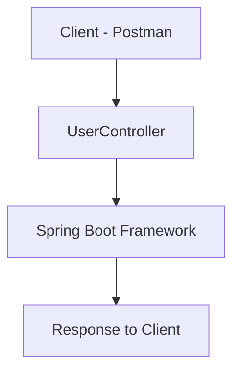
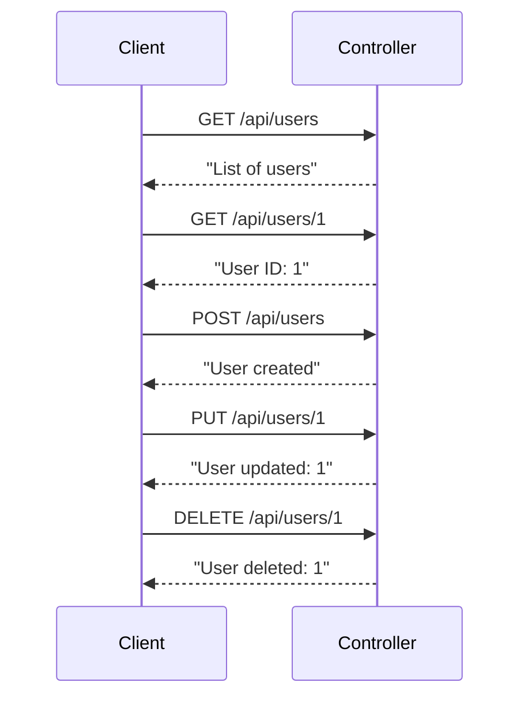

# Laboratory Report: Experiment 8  
**Course:** Fullstack Development - II  
**Topic:** Designing RESTful APIs Using Spring Boot  
**Date:** March 2026  

---

## 1. Aim
To design and implement a **RESTful API** using Spring Boot that performs CRUD operations and is tested using Postman.

---

## 2. Actual Code Context (Aligned)

The API is based on a simple controller:

```java
@RestController
@RequestMapping("/api/users")
public class UserController {

    @GetMapping
    public String getUsers() {
        return "List of users";
    }

    @GetMapping("/{id}")
    public String getUserById(@PathVariable int id) {
        return "User ID: " + id;
    }

    @PostMapping
    public String createUser() {
        return "User created";
    }

    @PutMapping("/{id}")
    public String updateUser(@PathVariable int id) {
        return "User updated: " + id;
    }

    @DeleteMapping("/{id}")
    public String deleteUser(@PathVariable int id) {
        return "User deleted: " + id;
    }
}
```

---

## 3. API Endpoints

| Method | Endpoint | Description |
|--------|----------|------------|
| GET | /api/users | Get all users |
| GET | /api/users/{id} | Get user by ID |
| POST | /api/users | Create user |
| PUT | /api/users/{id} | Update user |
| DELETE | /api/users/{id} | Delete user |

---

## 4. System Architecture



---

## 5. Request Flow



---

## 6. Implementation Flow with Screenshots

### 6.1 Controller Code


**Description:**  
Defines REST endpoints using Spring Boot annotations.

---

### 6.2 Server Execution


**Description:**  
Spring Boot application running on port 8080.

---

### 6.3 POST Request


**Description:**  
Creates a new user.

---

### 6.4 GET Request


**Description:**  
Fetches user data.

---

### 6.5 PUT Request


**Description:**  
Updates user information.

---

### 6.6 DELETE Request


**Description:**  
Deletes user record.

---

## 7. Key Learnings
- REST API design using Spring Boot  
- Mapping HTTP methods to endpoints  
- Using annotations for clean backend code  
- Testing APIs using Postman  

---

## 8. Conclusion
This implementation demonstrates a basic but complete REST API using Spring Boot. The controller handles all CRUD operations effectively and follows REST principles.

---

**Author:** Chirag Yadav  
**Date:** March 2026  

License: MIT
